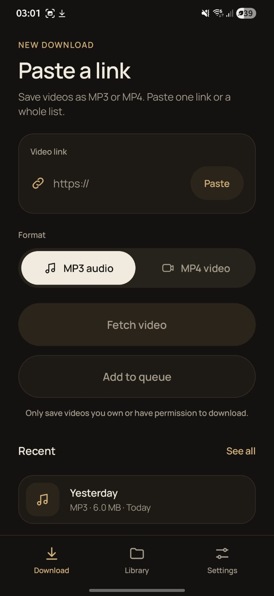
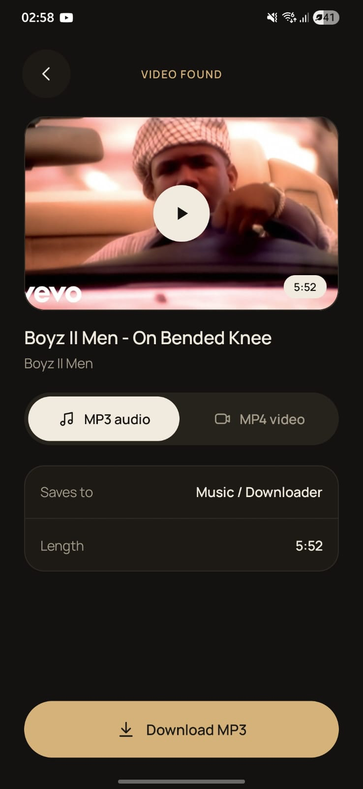
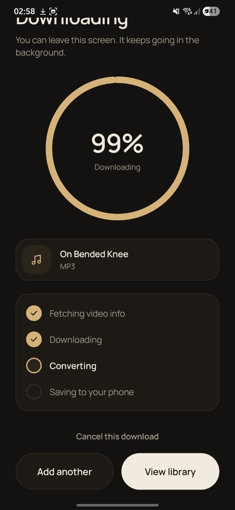
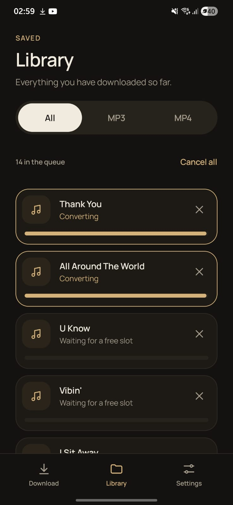
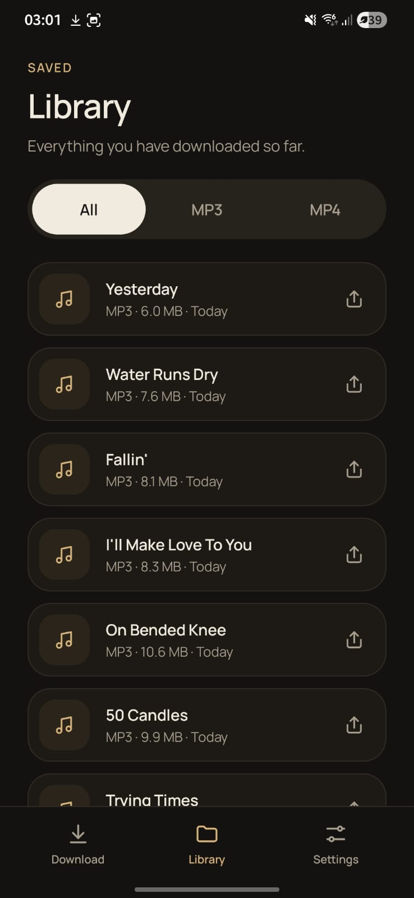

# YTDownloader

An Android app that saves videos and music to your phone as MP3 or MP4. Everything runs on the device, there is no server. I built it as a personal project to practise Jetpack Compose and to learn how to run a native tool (yt-dlp) inside an Android app.

## Screenshots

  
  
  
  
  

## What it does

- Paste a link and save it as MP3 or MP4 (choose the quality for video)
- Paste several links at once and they all go into a queue
- Paste a playlist or an album link and every track is added to the queue
- Several downloads run at the same time (you choose 1 to 3 in Settings)
- MP3 files get tags and cover art, and albums get their own folder with track numbers
- A notification shows the progress while the app is closed
- Share a link from YouTube to the app, and it can start downloading straight away (turn this on in Settings, and choose MP3 or MP4)
- Failed downloads try again automatically, and you can retry them by hand
- A library screen with everything you have downloaded, a search box, and a share button
- Play your MP3 and MP4 files inside the app
- Option to only download on Wi-Fi, so it does not use mobile data
- Settings for the default format and quality, the save folder name, how many downloads run at once, Wi-Fi only, and a button to update yt-dlp by hand
- Light and dark theme

## Built with

- Kotlin
- Jetpack Compose and Material 3
- [youtubedl-android](https://github.com/yausername/youtubedl-android) (the junkfood02 fork, version 0.18.1) for yt-dlp and ffmpeg
- Coroutines and StateFlow for the queue
- A foreground service for background downloads
- MediaStore so files show up in the normal Music and Movies folders

No navigation library and no database, to keep the dependencies small. The screens are switched with plain state, and the history is stored as JSON in SharedPreferences.

## How it is organised

- `data/DownloadController.kt` is the main part. It keeps the queue, runs the downloads and reads playlists
- `DownloadService.kt` keeps downloads alive in the background and shows the notification
- `ui/screens` has the four screens: paste a link, preview, downloading and library
- `ui/components` has the shared pieces like buttons, cards and the progress bar
- `ui/theme` has the colors, fonts, shapes and the animation helpers

## The design

I wanted it to look calm and clean: cream and near black backgrounds, a gold accent, rounded pill buttons and thin borders. The font is Manrope. Animations use springs and turn off if the system animations are off.

## Tests

There are unit tests for the link detection and the title cleaning in `app/src/test`. Run them with `./gradlew test`.

## Running it

1. Open the project in Android Studio
2. Let Gradle sync
3. Run it on an emulator or a phone (Android 8 or newer)

The first launch takes a few seconds because the download engine has to unpack itself. The app only includes the arm64 and x86_64 versions of the engine, so it will not run on old 32 bit phones.

## Note

This is a personal and learning project. Only download things you own or have permission to save, and follow the terms of the sites you use. I do not support piracy.

## Credits

- [yt-dlp](https://github.com/yt-dlp/yt-dlp) and [youtubedl-android](https://github.com/yausername/youtubedl-android)
- [Manrope](https://fonts.google.com/specimen/Manrope) font (SIL Open Font License)
